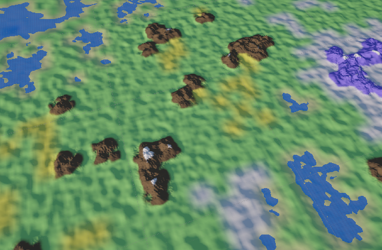
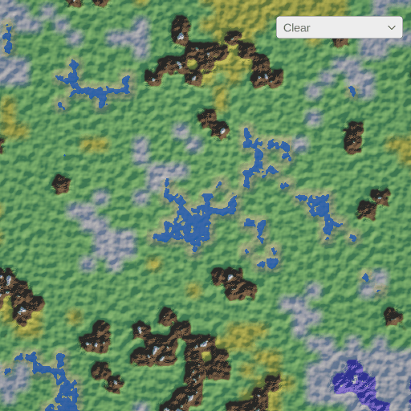

# Wave Function Collapse Terrain Generation

This is an algorithm that uses [Wave Function Collapse](https://github.com/mxgmn/WaveFunctionCollapse) to generate a grid of biomes, which is later used in combination with Perlin noise to procedurally generate terrain.

## How to run

Open scene named `SampleScene` and press "Play".

### Biome editing

Simple biome grid editing was added to demonstrate the flexibility of this terrain generation approach.
You can use the dropdown in the top right of the game view to select current "tool".
Available "tools" are:
- **Clear** - sets biome cells to `null` to be regenerated by WFC algorithm later and sets the selected terrain area to zero height
- **Regenerate** - fills all `null` biome cells with concrete biomes by using WFC algorithm and regenerates terrain for the selected area
- **Biomes** - sets biome cells to selected biomes and regenerates the selected terrain area with this biome only

### Experiments

To run experiments, find GameObject `Generator` in `SampleScene` and press "Start Experiments" button on `Terrain Experiments` component. Experiments results will be written to .csv files in root folder.